# Sidero Omni + Talos + Proxmox Starter Kit

**Production-ready Kubernetes cluster deployment on Proxmox VE using Sidero Omni and Talos Linux.**

Automate everything from VM provisioning to cluster formation with static IPs, Longhorn storage, and GPU support.

---

## 🎯 What This Does

Deploys a complete Kubernetes cluster on Proxmox with:
- ✅ **Static IP addresses** (no DHCP required)
- ✅ **Automated VM provisioning** via Terraform
- ✅ **GitOps cluster configuration** via Omni cluster templates
- ✅ **Longhorn storage** with secondary disks
- ✅ **GPU worker support** with NVIDIA drivers
- ✅ **Production configs** (hostDNS, kubePrism, system extensions)

---

## 📋 Quick Start (3 Steps)

```bash
# 1. Generate ISOs in Omni UI → Upload to Proxmox

# 2. Create VMs
cd terraform && terraform apply

# 3. Deploy cluster
cd ../scripts
./discover-machines.sh
./generate-machine-configs.sh
omnictl cluster template sync -f machine-configs/cluster-template.yaml
```

**Done!** Cluster forms in 5-10 minutes with all configurations applied.

---

## 🎨 Visual Workflow

### Complete Deployment Flow

```mermaid
graph TB
    subgraph "Step 1: Generate ISOs in Omni"
        A1[Open Omni UI] --> A2[Download Installation Media]
        A2 --> A3[Generate Standard ISO<br/>+ Extensions]
        A2 --> A4[Generate GPU ISO<br/>+ NVIDIA Extensions]
        A3 --> A5[Upload to Proxmox<br/>talos-1.11.5.iso]
        A4 --> A6[Upload to Proxmox<br/>talos-1.11.5-gpu.iso]
    end

    subgraph "Step 2: Terraform Creates VMs"
        B1[Configure terraform.tfvars<br/>• API tokens<br/>• IP addresses<br/>• MAC addresses<br/>• Disk sizes] --> B2[terraform apply]
        B2 --> B3[7 VMs Created<br/>• 3 Control Planes<br/>• 3 Workers<br/>• 1 GPU Worker]
        B3 --> B4[VMs Boot from ISO]
        B4 --> B5[Register with Omni<br/>Get UUIDs]
    end

    subgraph "Step 3: Configure & Deploy"
        C1[./discover-machines.sh<br/>Match by MAC] --> C2[./generate-machine-configs.sh<br/>Create cluster template]
        C2 --> C3[cluster-template.yaml<br/>• Static IPs<br/>• Hostnames<br/>• Storage mounts<br/>• GPU configs]
        C3 --> C4[omnictl cluster template sync]
        C4 --> C5[Cluster Forms<br/>All Configs Applied]
    end

    A5 --> B1
    A6 --> B1
    B5 --> C1

    style A3 fill:#e1f5ff
    style A4 fill:#e1f5ff
    style B3 fill:#fff4e1
    style C3 fill:#f0e1ff
    style C5 fill:#d4edda
```



### Network & System Architecture


---

## 📚 Prerequisites

### Infrastructure
- ✅ **Proxmox VE 8.x** installed and running
- ✅ **Sidero Omni** instance (self-hosted or cloud)
- ✅ **Network**: 192.168.10.0/24 (or your subnet)

### Software (install before starting)
```bash
# Install Terraform
sudo apt install terraform

# Install omnictl (get URL from Omni UI → Settings → CLI)
curl -Lo omnictl https://YOUR-OMNI-URL/omnictl/omnictl-linux-amd64
chmod +x omnictl && sudo mv omnictl /usr/local/bin/

# Install jq
sudo apt install jq
```

### Accounts & Access
- Proxmox API token ([how to create](#creating-proxmox-api-token))
- Omni account with authentication configured
- ISOs uploaded to Proxmox (Step 1 below)

---

## 🚀 Step-by-Step Deployment

### Step 1: Generate & Upload Talos ISOs

#### 1.1 Generate Standard ISO

In Omni UI:
1. Navigate to **Settings** → **Download Installation Media**
2. Select **Talos Linux v1.11.5**
3. Add System Extensions:
   - `siderolabs/qemu-guest-agent`
   - `siderolabs/nfsd`
   - `siderolabs/iscsi-tools`
   - `siderolabs/util-linux-tools`
4. Click **Generate** → Download → Rename to `talos-1.11.5.iso`

#### 1.2 Generate GPU ISO

Repeat above with additional extensions:
- `siderolabs/nonfree-kmod-nvidia-production`
- `siderolabs/nvidia-container-toolkit-production`

Rename to: `talos-1.11.5-gpu.iso`

#### 1.3 Upload to Proxmox

```bash
# Via SCP
scp talos-1.11.5.iso root@192.168.10.160:/var/lib/vz/template/iso/
scp talos-1.11.5-gpu.iso root@192.168.10.160:/var/lib/vz/template/iso/

# Or via Proxmox UI: Node → local → ISO Images → Upload
```

---

### Step 2: Configure Terraform

#### 2.1 Create Configuration

```bash
cd terraform
cp terraform.tfvars.example terraform.tfvars
nano terraform.tfvars
```

#### 2.2 Key Configuration Sections

**Proxmox API Token** (required):
```hcl
proxmox_servers = {
  "pve1" = {
    api_url          = "https://192.168.10.160:8006/api2/json"
    api_token_id     = "terraform@pve!terraform"
    api_token_secret = "YOUR_ACTUAL_TOKEN_HERE"  # ⚠️ Change this!
    node_name        = "hp-server-1"
    # ... storage config
  }
}
```

**Network Configuration**:
```hcl
network_config = {
  subnet      = "192.168.10.0/24"
  gateway     = "192.168.10.1"
  dns_servers = ["1.1.1.1", "1.0.0.1"]
  vlan_id     = 0
}
```

**VM Configuration** (review and adjust):
```hcl
control_planes = [
  {
    name              = "talos-control-1"
    ip_address        = "192.168.10.100"
    mac_address       = "BC:24:11:01:00:00"  # Predictable MACs
    cpu_cores         = 4
    memory_mb         = 8192
    os_disk_size_gb   = 70
    data_disk_size_gb = 0  # No secondary disk for control planes
  },
  # ... 2 more control planes
]

workers = [
  {
    name              = "talos-worker-1"
    ip_address        = "192.168.10.110"
    mac_address       = "BC:24:11:02:00:00"
    cpu_cores         = 8
    memory_mb         = 16384
    os_disk_size_gb   = 70
    data_disk_size_gb = 250  # For Longhorn storage
  },
  # ... more workers
]

gpu_workers = [
  {
    name              = "talos-gpu-worker-1"
    ip_address        = "192.168.10.115"
    mac_address       = "BC:24:11:03:00:00"
    cpu_cores         = 16
    memory_mb         = 32768
    os_disk_size_gb   = 70
    data_disk_size_gb = 250
    gpu_pci_id        = "01:00"  # Your GPU PCI ID
  }
]
```

#### 2.3 Create VMs

```bash
terraform init
terraform plan  # Review what will be created
terraform apply  # Type 'yes' to confirm
```

**Expected output:**
```
Apply complete! Resources: 7 added, 0 changed, 0 destroyed.

Outputs:
cluster_summary = {
  cluster_name = "talos-prod-cluster"
  total_vms = 7
  control_plane_count = 3
  worker_count = 3
  gpu_worker_count = 1
}
```

---

### Step 3: Wait for VMs to Register

After Terraform completes:
1. VMs boot from ISOs
2. Talos installs and connects to Omni via SideroLink
3. Machines appear in Omni UI as "Unknown" or "Available"

**Check Omni UI** → Machines (should see 7 machines)

**Typical wait time**: 2-5 minutes

---

### Step 4: Discover & Match Machines

```bash
cd scripts
./discover-machines.sh
```

**What this does:**
- Queries Omni for all registered machines
- Matches them to Terraform VMs by MAC address
- Creates UUID mapping file

**Expected output:**
```
✓ Found 7 machines in Terraform inventory
✓ Found 7 machines registered in Omni
✓ Matched: talos-control-1 (BC:24:11:01:00:00) -> Omni UUID: e8ebd88b...
✓ Matched: talos-control-2 (BC:24:11:01:00:01) -> Omni UUID: 73d9b30a...
✓ Matched: talos-control-3 (BC:24:11:01:00:02) -> Omni UUID: 8e49c19b...
✓ Matched: talos-worker-1 (BC:24:11:02:00:00) -> Omni UUID: aff4cb8e...
✓ Matched: talos-worker-2 (BC:24:11:02:00:01) -> Omni UUID: a24fcd51...
✓ Matched: talos-worker-3 (BC:24:11:02:00:02) -> Omni UUID: cc1e0d4d...
✓ Matched: talos-gpu-worker-1 (BC:24:11:03:00:00) -> Omni UUID: 15498cdd...

Matched: 7
Unmatched: 0
```

**Output files:**
- `scripts/machine-data/matched-machines.json` - Full machine data
- `scripts/machine-data/machine-uuids.txt` - Quick reference
- `scripts/machine-data/mac-to-uuid.txt` - MAC → UUID mapping

---

### Step 5: Generate Cluster Template

```bash
./generate-machine-configs.sh
```

**What this does:**
- Reads matched machines from Step 4
- Generates cluster template with ALL critical configurations:
  - ✅ Static IPs with MAC-based interface selection
  - ✅ Hostnames
  - ✅ Longhorn disk mounts (for workers/GPU workers)
  - ✅ NVIDIA GPU configurations
  - ✅ Network settings (gateway, DNS)
  - ✅ System extensions

**Prompts:**
```
Cluster name [talos-cluster]: talos-prod-cluster
```

**Expected output:**
```
✓ Generated 7 machine configurations

Generated configurations:
  Control Planes: 3
  Workers:        3
  GPU Workers:    1
  Total:          7

Files created:
  Combined template: machine-configs/cluster-template.yaml
```

---

### Step 6: Apply Cluster Template

```bash
omnictl cluster template sync -f machine-configs/cluster-template.yaml
```

**What this does:**
- Creates cluster in Omni
- Applies all machine patches (hostname, network, storage)
- Assigns machines to control plane and worker pools
- Installs system extensions
- Configures Longhorn storage mounts
- Sets up GPU workers with NVIDIA drivers

**Expected output:**
```
* creating Clusters.omni.sidero.dev(talos-prod-cluster)
* creating ExtensionsConfigurations.omni.sidero.dev(schematic-talos-prod-cluster)
* creating ExtensionsConfigurations.omni.sidero.dev(schematic-talos-prod-cluster-gpu-workers)
* creating ConfigPatches.omni.sidero.dev(...)
* creating MachineSets.omni.sidero.dev(talos-prod-cluster-control-planes)
* creating MachineSets.omni.sidero.dev(talos-prod-cluster-workers)
* creating MachineSets.omni.sidero.dev(talos-prod-cluster-gpu-workers)
* creating MachineSetNodes.omni.sidero.dev(...)
```

---

### Step 7: Monitor Cluster Formation

#### Watch in Omni UI

Navigate to **Clusters** → `talos-prod-cluster`

Machines transition through phases:
```
Unknown → Configuring → Installing → Booting → Running
```

**Expected time:** 5-10 minutes

#### Watch from CLI

```bash
# Check cluster status
omnictl get clusters

# Watch machine status
watch omnictl get machines

# View cluster events
omnictl get events -f
```

---

### Step 8: Verify Cluster

Once all nodes show "Running":

```bash
# Get kubeconfig
omnictl kubeconfig -c talos-prod-cluster > ~/.kube/talos-prod-config
export KUBECONFIG=~/.kube/talos-prod-config

# Check nodes
kubectl get nodes -o wide

# Expected output:
NAME                 STATUS   ROLES           AGE   VERSION   INTERNAL-IP
talos-control-1      Ready    control-plane   5m    v1.34.1   192.168.10.100
talos-control-2      Ready    control-plane   5m    v1.34.1   192.168.10.101
talos-control-3      Ready    control-plane   5m    v1.34.1   192.168.10.102
talos-worker-1       Ready    worker          4m    v1.34.1   192.168.10.110
talos-worker-2       Ready    worker          4m    v1.34.1   192.168.10.111
talos-worker-3       Ready    worker          4m    v1.34.1   192.168.10.112
talos-gpu-worker-1   Ready    worker          4m    v1.34.1   192.168.10.115

# Check system pods
kubectl get pods -A

# All pods should be Running
```

#### Verify Static IPs

```bash
# Check nodes have static IPs (not DHCP)
kubectl get nodes -o custom-columns=NAME:.metadata.name,IP:.status.addresses[0].address
```

#### Verify Longhorn Storage

```bash
# Get talosconfig
omnictl talosconfig -c talos-prod-cluster

# Check disk mounts on workers
talosctl -n 192.168.10.110 exec -- df -h | grep longhorn

# Expected:
/dev/sdb1       250G   1.5G  248G   1% /var/mnt/longhorn_sdb

# Check kubelet mount
talosctl -n 192.168.10.110 exec -- ls -la /var/lib/longhorn
# Should show it's mounted and accessible
```

#### Verify GPU (if GPU worker)

```bash
# Check NVIDIA drivers loaded
talosctl -n 192.168.10.115 exec -- nvidia-smi

# Expected: GPU info displayed
```

---

## 🔧 Configuration Deep Dive

### How Static IPs Work

The cluster template uses **MAC-based interface selection** for reliable network configuration:

```yaml
machine:
  network:
    hostname: talos-worker-1
    interfaces:
      - deviceSelector:
          hardwareAddr: "BC:24:11:02:00:00"  # Match by MAC
        dhcp: false  # Disable DHCP
        addresses:
          - 192.168.10.110/24
        routes:
          - network: 0.0.0.0/0
            gateway: 192.168.10.1
    nameservers:
      - 1.1.1.1  # Cloudflare DNS
      - 1.0.0.1
```

**Why this works:**
- MAC addresses are unique and don't change
- `dhcp: false` prevents DHCP override
- Real DNS servers (not gateway)
- Applied before cluster formation

### How Longhorn Storage Works

Workers with secondary disks get **two-part configuration**:

```yaml
machine:
  disks:
    - device: /dev/sdb  # Physical disk
      partitions:
        - mountpoint: /var/mnt/longhorn_sdb  # Mount point
  kubelet:
    extraMounts:
      - destination: /var/lib/longhorn  # Where Longhorn expects storage
        source: /var/mnt/longhorn_sdb   # Points to mounted disk
        type: bind
        options: [bind, rshared, rw]
```

**Why this works:**
- `machine.disks` mounts the physical disk at boot
- `kubelet.extraMounts` makes it available to Longhorn
- Bind mount allows Longhorn to use the storage

### GPU Worker Configuration

GPU workers get additional configuration:

```yaml
machine:
  kernel:
    modules:
      - name: nvidia
      - name: nvidia_uvm
      - name: nvidia_drm
      - name: nvidia_modeset
  files:
    - path: /etc/cri/conf.d/20-customization.part
      content: |
        [plugins."io.containerd.grpc.v1.cri".containerd.runtimes.nvidia]
          runtime_type = "io.containerd.runc.v2"
          [plugins."io.containerd.grpc.v1.cri".containerd.runtimes.nvidia.options]
            BinaryName = "/usr/bin/nvidia-container-runtime"
```

**System Extensions:**
- `siderolabs/nonfree-kmod-nvidia-production` - NVIDIA kernel drivers
- `siderolabs/nvidia-container-toolkit-production` - Container runtime

---

## 📖 Detailed Guides

- **[DEPLOYMENT-WORKFLOW.md](DEPLOYMENT-WORKFLOW.md)** - Complete deployment guide with troubleshooting
- **[REVIEW-SUMMARY.md](REVIEW-SUMMARY.md)** - Summary of recent fixes and improvements
- **[terraform/README.md](terraform/README.md)** - Terraform configuration guide
- **[sidero-omni/README.md](sidero-omni/README.md)** - Self-hosted Omni deployment

---

## ❓ Troubleshooting

### Machines don't appear in Omni

**Check:**
```bash
# Verify VMs are running
ssh root@192.168.10.160 qm list

# Check VM console (Proxmox UI)
# Should show Talos boot messages and SideroLink connection
```

**Solution:** Verify ISOs were generated from your Omni instance (embedded join token)

---

### Discovery script can't match machines

**Symptom:** `discover-machines.sh` shows "Not found in Omni"

**Check:**
```bash
# Compare MACs from Terraform
cd terraform && terraform output mac_to_ip_mapping

# Compare MACs from Omni
omnictl get machinestatus -o json | jq -r '.[] | {mac: .spec.network.networklinks[0].hardwareaddress, uuid: .metadata.id}'
```

**Solution:** MACs must match exactly (case-insensitive). If they don't, check Proxmox VM network configuration.

---

### Static IPs not applying

**Check:**
```bash
# View cluster template network config
cat scripts/machine-configs/cluster-template.yaml | grep -A 10 "deviceSelector"

# Should see:
#   deviceSelector:
#     hardwareAddr: "BC:24:11:..."
#   dhcp: false
```

**Solution:** Ensure cluster template has `deviceSelector` and `dhcp: false`. Re-run `generate-machine-configs.sh` if needed.

---

### Longhorn storage not mounting

**Check:**
```bash
# Check disk exists in Proxmox
ssh root@192.168.10.160 qm config <VMID> | grep scsi

# Should show two disks:
# scsi0: local-lvm:vm-xxx-disk-0,size=70G  (OS)
# scsi1: local-lvm:vm-xxx-disk-1,size=250G (Data)

# Check mount in Talos
omnictl talosconfig -c talos-prod-cluster
talosctl -n 192.168.10.110 exec -- lsblk

# Should show:
# sda  70G  (OS disk)
# sdb  250G (Data disk)
```

**Solution:**
1. Verify `data_disk_size_gb > 0` in terraform.tfvars
2. Check cluster template has `machine.disks` configuration
3. Re-run `generate-machine-configs.sh` and re-sync

---

### Cluster not forming

**Check cluster events:**
```bash
omnictl get events -f
```

**Common issues:**
- Insufficient resources (CPU/RAM)
- Network connectivity between nodes
- Etcd quorum issues (need 3+ control planes for HA)

**Solution:** Check Omni UI cluster events for specific errors

---

## 🏗️ Project Structure

```
.
├── terraform/                       # VM provisioning
│   ├── main.tf                      # VM resources
│   ├── variables.tf                 # Input variables
│   ├── outputs.tf                   # Machine inventory
│   ├── terraform.tfvars             # Your config (not in repo)
│   └── terraform.tfvars.example     # Example config
│
├── scripts/                         # Automation scripts
│   ├── discover-machines.sh         # Match VMs to Omni UUIDs
│   ├── generate-machine-configs.sh  # Generate cluster template
│   ├── machine-data/                # Discovered machine data
│   └── machine-configs/             # Generated cluster template
│
├── sidero-omni/                     # Self-hosted Omni deployment (optional)
│   ├── docker-compose.yml
│   └── README.md
│
├── DEPLOYMENT-WORKFLOW.md           # Detailed deployment guide
├── REVIEW-SUMMARY.md                # Recent improvements summary
└── README.md                        # This file
```

---

## 🎓 How It Works

### The Automation Flow


### Why This Approach?

**Terraform** creates VMs with:
- Predictable MAC addresses
- Consistent resource allocation
- Infrastructure as Code (repeatable)

**Discovery script** bridges the gap:
- Terraform knows MACs, not UUIDs
- Omni knows UUIDs, not names
- Script matches them by MAC

**Cluster template** contains everything:
- Network configuration (static IPs)
- Storage configuration (Longhorn)
- GPU configuration (NVIDIA)
- System extensions
- All machine patches

**GitOps-ready:**
- Store cluster-template.yaml in Git
- Apply changes via `omnictl cluster template sync`
- Version control your entire cluster config

---

## 🆕 What's New (Recent Fixes)

### Network Configuration Overhaul
- ✅ **deviceSelector with hardwareAddr** for reliable MAC-based interface selection
- ✅ **dhcp: false** to prevent DHCP override
- ✅ **Real DNS servers** (1.1.1.1, 1.0.0.1 instead of gateway)

### Storage Configuration Fixes
- ✅ **machine.disks** configuration to mount /dev/sdb
- ✅ **Correct mount paths** (/var/mnt/longhorn_sdb)
- ✅ **kubelet extraMounts** pointing to mounted disk

### Workflow Improvements
- ✅ **Simplified discovery** - just discovery, no side effects
- ✅ **Single cluster template sync** - everything applies at once
- ✅ **Better error messages** and troubleshooting guides

See [REVIEW-SUMMARY.md](REVIEW-SUMMARY.md) for complete details.

---

## 🤝 Contributing

Contributions welcome! Please:
- Test changes in a real environment
- Update documentation
- Keep the focus on simplicity and visual clarity

---

## 📄 License

MIT License - Use freely, modify as needed.

---

## 🔗 Resources

- **Sidero Omni**: https://omni.siderolabs.com
- **Talos Linux**: https://www.talos.dev
- **Proxmox VE**: https://www.proxmox.com
- **Terraform Proxmox Provider**: https://github.com/Telmate/terraform-provider-proxmox

---

## 💬 Support

- **Issues**: Open a GitHub issue
- **Discussions**: GitHub Discussions for questions
- **Siderolabs Discord**: https://discord.gg/siderolabs

---

**Built with ❤️ for the homelab community**
