# Sidero Omni + Talos + Proxmox Starter Kit

**The simple way to deploy production Talos Linux clusters on Proxmox with Sidero Omni.**

Stop fighting with UUIDs, IP addresses, and manual configuration. This starter kit automates everything from infrastructure provisioning to cluster deployment using PXE boot + Terraform + Omni.

## What This Repo Does

**For**: Experienced devs who want to try Talos Linux with Proxmox
**Problem**: Connecting Terraform VMs → PXE boot → Omni UUIDs → Hostnames/IPs is confusing
**Solution**: Automated scripts that handle all the abstraction layers for you

### The Workflow (4 Simple Steps)

```
1. Deploy Omni (management platform)          → cd sidero-omni && docker-compose up
2. Deploy Booter (PXE boot server)            → cd deployment-methods/pxe-boot && docker-compose up
3. Create VMs with Terraform                  → cd terraform && terraform apply
4. Match & configure with scripts             → cd scripts && ./discover-machines.sh
   ↓
Machines appear in Omni with proper names, IPs, and roles!
```

## Key Features

- ✅ **PXE Boot**: VMs network boot into Talos automatically (no ISO management)
- ✅ **Full Automation**: Terraform → Booter → Omni → Scripts handle everything
- ✅ **MAC Address Matching**: Scripts automatically map Terraform VMs to Omni UUIDs
- ✅ **Production Configs**: Pre-configured with hostDNS, kubePrism, Longhorn, GPU support
- ✅ **Multiple Proxmox Servers**: Distribute VMs across 2-3+ Proxmox hosts
- ✅ **GPU Workers**: Full NVIDIA containerd runtime + kernel modules
- ✅ **Self-Hosted Omni**: Complete Docker Compose setup with Auth0/SAML

## Quick Start

### Prerequisites

**Infrastructure**:
- 1x Linux VM/NUC for Omni + Booter (same machine)
- 1-3x Proxmox VE 8.x or 9.x servers
- Network with DHCP server (Firewalla, pfSense, router)

**Software** (will be installed):
- Docker & Docker Compose
- Terraform 1.0+
- omnictl CLI
- jq (JSON processor)

**Accounts**:
- Domain with Cloudflare DNS (for Let's Encrypt)
- Auth0 account (free tier works)
- Proxmox API tokens ([setup guide](terraform/README.md#proxmox-api-token-setup))

---

## Step 1: Deploy Sidero Omni

Deploy the management platform on a Linux VM or NUC:

```bash
cd sidero-omni

# Check prerequisites
./check-prerequisites.sh

# Install Docker if needed
./install-docker.sh

# Setup SSL certificates (Let's Encrypt + Cloudflare)
sudo ./setup-certificates.sh

# Generate GPG key for etcd encryption
./generate-gpg-key.sh

# Configure environment
cp .env.example omni.env
nano omni.env  # Set your domain, Auth0, etc.

# Start Omni
docker compose --env-file omni.env up -d

# Check logs
docker logs -f omni
```

**Verify**: Open `https://your-domain.com` and login via Auth0.

📖 **Full Guide**: [sidero-omni/README.md](sidero-omni/README.md)

---

## Step 2: Deploy Booter (PXE Server)

On the same machine as Omni, deploy the PXE boot server:

```bash
cd deployment-methods/pxe-boot

# Edit docker-compose.yml
nano docker-compose.yml
```

Update these values:
- `--api-advertise-address=192.168.10.15` (your Omni host IP)
- `--dhcp-proxy-iface-or-ip=enp1s0` (your network interface, find with `ip addr show`)
- Paste kernel args from Omni UI (Overview → Copy Kernel Parameters)

```bash
# Start Booter
docker-compose up -d

# Verify
docker logs -f sidero-booter
ss -ulnp | grep :69  # TFTP should be listening
```

📖 **Full Guide**: [deployment-methods/pxe-boot/README.md](deployment-methods/pxe-boot/README.md)

---

## Step 3: Create VMs with Terraform

Provision VMs on Proxmox with PXE boot:

```bash
cd terraform

# Copy example config
cp terraform.tfvars.example terraform.tfvars

# Edit configuration
nano terraform.tfvars
```

**Key settings**:
```hcl
boot_method = "pxe"  # Use PXE boot (recommended)

proxmox_servers = {
  "pve1" = {
    api_url          = "https://192.168.10.160:8006/api2/json"
    api_token_id     = "terraform@pve!terraform"
    api_token_secret = "your-secret-here"
    node_name        = "pve1"
    storage_os       = "local-lvm"
    storage_data     = "hddpool"
    network_bridge   = "vmbr0"
  }
}

control_planes = [
  {
    name              = "talos-control-1"
    proxmox_server    = "pve1"
    ip_address        = "192.168.10.120"
    mac_address       = ""  # Auto-generated
    cpu_cores         = 4
    memory_mb         = 8192
    os_disk_size_gb   = 50
    data_disk_size_gb = 100
  },
  # Add 2 more for HA (3 total)
]

workers = [
  {
    name              = "talos-worker-1"
    proxmox_server    = "pve1"
    ip_address        = "192.168.10.130"
    mac_address       = ""
    cpu_cores         = 8
    memory_mb         = 16384
    os_disk_size_gb   = 65
    data_disk_size_gb = 200  # For Longhorn
  },
]
```

```bash
# Initialize and apply
terraform init
terraform plan
terraform apply
```

VMs will PXE boot into Talos and appear in Omni UI (with UUIDs, not names yet).

📖 **Full Guide**: [terraform/README.md](terraform/README.md)

---

## Step 4: Match & Configure Machines

The automation scripts connect Terraform data to Omni machines:

```bash
cd scripts

# Step 0: Install and configure omnictl
# Download omnictl binary from your Omni dashboard
# See detailed instructions below in "Installing omnictl"

# 1. Match VMs to Omni machines by MAC address
./discover-machines.sh

# Output:
# ✓ Matched: talos-control-1 (BC:24:11:01:00:00) -> Omni UUID: 7bfdca4c...
# ✓ Matched: talos-control-2 (BC:24:11:01:00:01) -> Omni UUID: 468090e7...
# ✓ Matched: talos-control-3 (BC:24:11:01:00:02) -> Omni UUID: 78c997c5...
# Matched: 6/6

# 2. Generate Omni cluster templates with production configs
./generate-machine-configs.sh

# Output:
# ✓ Generated 6 machine configurations
# Files created:
#   machine-configs/cluster-template.yaml
#   machine-configs/talos-control-1.yaml
#   machine-configs/talos-worker-1.yaml

# 3. Apply configurations to Omni
./apply-machine-configs.sh

# Prompt: Apply this configuration to Omni? (yes/no): yes
# ✓ Cluster template applied successfully
```

**Result**: Machines now show in Omni with proper:
- ✅ Hostnames (talos-control-1, talos-worker-1, etc.)
- ✅ IP addresses (192.168.10.120, etc.)
- ✅ Roles (control-plane, worker, gpu-worker)
- ✅ Production configs (hostDNS, kubePrism, Longhorn mounts, GPU support)

📖 **Full Guide**: [scripts/README.md](scripts/README.md)

---

## Installing omnictl

The `omnictl` CLI is required to interact with your Omni instance. Follow these steps to install and configure it on macOS.

### Step 1: Download omnictl

Download the `omnictl` binary from your Omni dashboard:

1. Open your Omni UI (e.g., `https://omni.vanillax.me`)
2. Click the download button to get `omnictl-darwin-amd64` (macOS Intel) or `omnictl-darwin-arm64` (macOS Apple Silicon)
3. Also download `omniconfig.yaml` from the same page

### Step 2: Install the Binary

```bash
# Navigate to your downloads
cd ~/Downloads

# Make executable and move to system path
chmod +x omnictl-darwin-amd64
sudo mv omnictl-darwin-amd64 /usr/local/bin/omnictl

# Verify installation
omnictl --version
# Should show: omnictl version v1.3.1 (API Version: 1)
```

### Step 3: Configure omnictl

**Important**: On macOS, omnictl uses **two possible config locations** (checks in this order):
1. **Primary**: `~/.talos/omni/config` (recommended)
2. **Fallback**: `~/Library/Application Support/omni/config` (deprecated but still works)

Copy your `omniconfig.yaml` to the correct location:

```bash
# Option 1: Use ~/.talos/omni/config (recommended)
mkdir -p ~/.talos/omni
cp ~/Downloads/omniconfig.yaml ~/.talos/omni/config

# Option 2: Use ~/Library/Application Support/omni/config (legacy)
mkdir -p ~/Library/Application\ Support/omni
cp ~/Downloads/omniconfig.yaml ~/Library/Application\ Support/omni/config
```

### Step 4: Verify Configuration

```bash
# List contexts
omnictl config contexts

# Should show:
# CURRENT   NAME      URL
# *         default   https://omni.vanillax.me

# Test connection
omnictl get clusters

# Should show empty list or existing clusters (no errors)
```

### Troubleshooting omnictl

**"unknown service cosi.resource.State" error**:
- **Cause**: Version mismatch between omnictl and Omni server
- **Fix**: Download omnictl from your Omni dashboard (not Homebrew)

**"dns resolver: missing address" error**:
- **Cause**: Using wrong config file (talosconfig instead of omniconfig)
- **Fix**: Use the `omniconfig.yaml` from Omni dashboard, not `talosconfig.yaml`

**Config not loading**:
```bash
# Check which config file is being used
omnictl --help | grep omniconfig

# Default path should be: $HOME/.talos/omni/config

# Verify config exists
cat ~/.talos/omni/config
```

**Auth0 login issues**:
```bash
# Clear old auth and re-authenticate
rm -rf ~/.talos/keys
omnictl get clusters  # Will trigger browser login
```

---

## Step 5: Create Cluster in Omni

Now create your cluster in the Omni UI:

1. Go to Omni UI → **Clusters** → **Create Cluster**
2. Machines now have friendly names (not UUIDs!)
3. Select machines by role:
   - **Control Planes**: Pick 3 machines (for HA)
   - **Workers**: Pick remaining machines
4. Configure:
   - Kubernetes version: v1.34.1
   - Talos version: v1.11.5
5. Click **Create**

Omni will install Talos to disk, configure everything, and bootstrap Kubernetes.

**Monitor progress**:
```bash
# Watch nodes come online
omnictl get machines --watch

# Once ready, get kubeconfig
omnictl kubeconfig > kubeconfig.yaml
export KUBECONFIG=kubeconfig.yaml

# Verify cluster
kubectl get nodes -o wide
kubectl get pods -A
```

---

## Complete Workflow: How Everything Fits Together

This section explains the **complete end-to-end flow** from Terraform to a running cluster, including critical details about boot order and system extensions that prevent common issues.

### Full Deployment Flow

```mermaid
flowchart TD
    A[1. Terraform Creates VMs] -->|VM Config:<br/>- VMID: 100-129<br/>- Boot: scsi0,net0<br/>- Agent: enabled<br/>- MAC addresses| B[VMs Created in Proxmox]

    B -->|First boot:<br/>Empty disk| C{Boot Order Check}
    C -->|Disk empty| D[Falls through to PXE]

    D -->|DHCP Request| E[Booter DHCP Proxy]
    E -->|Serves Talos Image<br/>+ Base Extensions*| F[Talos Boots in Memory]

    F -->|SideroLink Connection| G[Registers with Omni<br/>Gets UUID]

    G --> H[2. Scripts: discover-machines.sh]
    H -->|Match by MAC| I[Terraform VMs ↔ Omni UUIDs]

    I --> J[3. Scripts: generate-machine-configs.sh]
    J -->|Creates cluster-template.yaml<br/>+ Cluster Extensions**<br/>+ GPU Pool Extensions***| K[Machine Configs Generated]

    K --> L[4. Scripts: apply-machine-configs.sh]
    L -->|omnictl cluster template sync| M[Omni Applies Config]

    M -->|Installs Talos to Disk<br/>+ All Extensions| N[VM Reboots]

    N -->|Second boot:<br/>Disk has OS| C
    C -->|Disk has Talos| O[Boots from Disk]
    O -->|Maintains UUID ✓| P[Cluster Running]

    style A fill:#e1f5ff
    style G fill:#fff4e1
    style M fill:#f0e1ff
    style P fill:#e1ffe1
```



### Critical Implementation Details

#### 🔑 Boot Order: `scsi0;net0` (Disk First)

**Why this matters**:
- **First boot**: Disk is empty → Falls through to PXE → Talos installs
- **Subsequent boots**: Disk has Talos → Boots from disk → **Maintains machine identity**
- **What we prevent**: If boot order was `net0;scsi0`, every reboot would PXE boot first, potentially generating new UUIDs and breaking Omni's tracking

**Location**: `terraform/main.tf`
```hcl
boot = "order=scsi0;net0"  # Disk first, network fallback
```

#### 🧩 System Extensions: Two-Layer Architecture

System extensions add functionality to Talos (iSCSI, NFS, QEMU agent, NVIDIA drivers). They're applied in two layers:

**Layer 1 - PXE Boot (Booter)***:
- **When**: During initial PXE boot (optional)
- **How**: Booter serves Talos image with extensions baked in via Image Factory schematic
- **Extensions**: Base extensions only (iscsi-tools, nfsd, qemu-guest-agent, util-linux-tools)
- **Purpose**: Machines boot with base functionality from first boot
- **Configure**: Run `./deployment-methods/pxe-boot/generate-schematic.sh`

**Layer 2 - Omni Cluster Templates**:
- **When**: When cluster template is applied (Step 4)
- **How**: Defined in `cluster-template.yaml` at Cluster and Workers pool levels
- **Extensions**:
  - Cluster level**: iscsi-tools, nfsd, qemu-guest-agent, util-linux-tools (all machines)
  - GPU pool***: nonfree-kmod-nvidia-production, nvidia-container-toolkit-production (GPU workers only)
- **Purpose**: Ensures all machines have required extensions regardless of PXE boot config
- **Result**: GPU workers get 6 total extensions (4 base + 2 NVIDIA)

**Why two layers?**
- **Redundancy**: Extensions applied via Omni even if Booter schematic not configured
- **Flexibility**: GPU extensions only on gpu-workers pool, not PXE image
- **Production-ready**: Base functionality available immediately on first boot

#### ⚡ Fast VM Creation: Skip Guest Agent Wait

**The issue**: Terraform with `agent = 1` waits for QEMU guest agent to respond before completing
**The problem**: Agent not available until Talos boots and extension loads (30+ minute timeout)
**The fix**: `define_connection_info = false` tells Terraform not to wait

**Location**: `terraform/main.tf`
```hcl
agent = 1                          # Enable QEMU agent in Proxmox
define_connection_info = false     # Don't wait for agent during creation
```

**Result**: Fast VM creation (seconds) + Guest agent works after Talos boots

---

## What Each Component Does

| Component | Purpose | Location |
|-----------|---------|----------|
| **Omni** | Cluster management UI + API | `sidero-omni/` |
| **Booter** | PXE boot server (serves Talos images) | `deployment-methods/pxe-boot/` |
| **Terraform** | Creates VMs in Proxmox | `terraform/` |
| **Scripts** | Matches VMs → Omni, generates configs | `scripts/` |

### How They Connect

```
Terraform                Booter                 Omni
   ↓                        ↓                     ↓
Creates VMs  →  VMs PXE boot into Talos  →  Talos registers with Omni
   ↓                                              ↓
Outputs MAC addresses              Scripts match by MAC address
                                             ↓
                                   Apply hostnames, IPs, configs
```

---

## Architecture Overview

```
┌─────────────────────────────────────────────────────────────┐
│                    Your Network (192.168.10.0/24)            │
├─────────────────────────────────────────────────────────────┤
│                                                               │
│  ┌──────────────┐      ┌──────────────┐                     │
│  │   Omni Host  │      │  Firewalla   │                     │
│  │ (Omni+Booter)│      │ (DHCP Server)│                     │
│  │ .10.15       │      │ .10.1        │                     │
│  └──────────────┘      └──────────────┘                     │
│         │                      │                             │
│         │ SideroLink          │ DHCP + PXE Proxy            │
│         │                      │                             │
│  ┌──────┴──────────────────────┴─────────┐                 │
│  │                                         │                 │
│  │         Proxmox Server(s)              │                 │
│  │                                         │                 │
│  │  ┌─────────┐  ┌─────────┐  ┌─────────┐│                 │
│  │  │Control-1│  │Worker-1 │  │GPU      ││                 │
│  │  │.10.120  │  │.10.130  │  │Worker-1 ││                 │
│  │  │PXE Boot │  │PXE Boot │  │.10.140  ││                 │
│  │  └─────────┘  └─────────┘  └─────────┘│                 │
│  └─────────────────────────────────────────                 │
│                                                               │
└─────────────────────────────────────────────────────────────┘
```

---

## Common Issues

### VMs stuck in PXE boot loop

**Symptom**: VMs reboot endlessly at "Configuring (net0)..."

**Solution**: Check Booter configuration:
```bash
docker logs sidero-booter | grep -i dhcp

# Make sure:
# 1. --api-advertise-address is correct
# 2. --dhcp-proxy-iface-or-ip matches your interface (ip addr show)
# 3. Kernel args are correct (copy from Omni UI)
```

See: [PXE Boot Troubleshooting](deployment-methods/pxe-boot/README.md#troubleshooting)

### Scripts can't match machines

**Symptom**: `discover-machines.sh` shows "Not found in Omni"

**Solution**: Check MAC addresses match:
```bash
# From Terraform
cd terraform && terraform output mac_to_ip_mapping

# From Omni
omnictl get machinestatus -o json | jq '.[] | {uuid: .metadata.id, mac: .spec.network.networklinks[0].hardwareaddress}'
```

### Machines don't show hostnames after applying configs

**Solution**: Wait 2-3 minutes for configs to propagate, then check:
```bash
omnictl get machines -o json | jq '.[] | {uuid: .metadata.id, hostname: .metadata.labels["omni.sidero.dev/hostname"]}'
```

---

## Alternative Deployment Methods

This repo focuses on **Terraform + PXE** as the primary method, but we also document:

- **ISO Boot**: For networks without PXE support ([iso-templates/](deployment-methods/iso-templates/))
- **Omni Infrastructure Provider**: Auto-provision from Omni UI ([omni-provider/](deployment-methods/omni-provider/))

See: [deployment-methods/README.md](deployment-methods/README.md)

---

## GPU Worker Configuration

GPU workers are fully supported with:
- ✅ NVIDIA containerd runtime
- ✅ NVIDIA kernel modules (nvidia, nvidia_uvm, nvidia_drm, nvidia_modeset)
- ✅ GPU scheduling labels
- ✅ Longhorn storage mounts

The `generate-machine-configs.sh` script automatically adds GPU configs for any `gpu-worker` role machines.

**Manual GPU Passthrough** (required after Terraform):
```bash
# 1. SSH to Proxmox host
ssh root@pve1

# 2. Find GPU PCI ID
lspci | grep -i nvidia
# Example: 01:00.0 VGA compatible controller: NVIDIA Corporation ...

# 3. Find VM ID
qm list | grep talos-worker-gpu

# 4. Add GPU passthrough
qm set <VM_ID> -hostpci0 01:00,pcie=1

# 5. Reboot VM
qm reboot <VM_ID>
```

---

## Project Structure

```
.
├── sidero-omni/                      # Omni deployment (Docker Compose)
│   ├── docker-compose.yml            # Official Sidero Labs format
│   ├── setup-certificates.sh         # Let's Encrypt automation
│   └── README.md                     # Complete Omni setup guide
│
├── deployment-methods/
│   └── pxe-boot/                     # PXE boot with Booter
│       ├── docker-compose.yml        # Working Booter configuration
│       └── README.md                 # PXE setup + troubleshooting
│
├── terraform/                        # VM provisioning
│   ├── main.tf                       # Multi-server VM creation
│   ├── variables.tf                  # Flexible configuration
│   ├── terraform.tfvars.example      # Configuration template
│   └── README.md                     # Terraform guide
│
└── scripts/                          # Automation scripts
    ├── discover-machines.sh          # Match Terraform → Omni by MAC
    ├── generate-machine-configs.sh   # Generate cluster templates
    ├── apply-machine-configs.sh      # Apply to Omni
    └── README.md                     # Scripts workflow guide
```

---

## Credits & Links

- **Sidero Labs** - Creators of Talos Linux and Omni ([siderolabs.com](https://www.siderolabs.com))
- **Talos Linux** - Immutable Kubernetes OS ([talos.dev](https://www.talos.dev))
- **Sidero Omni** - Kubernetes cluster management ([omni.siderolabs.com](https://omni.siderolabs.com))
- **Proxmox VE** - Virtualization platform ([proxmox.com](https://www.proxmox.com))

---

## License

MIT License - Use freely, modify as needed, no warranty provided.

---

## Support & Contributions

**Issues**: Open a GitHub issue for bugs or questions
**PRs**: Contributions welcome! Keep the focus on simplicity.

**Philosophy**: This repo prioritizes **simplicity and clarity** over feature completeness. The goal is to help experienced devs get started quickly, not to cover every edge case.
